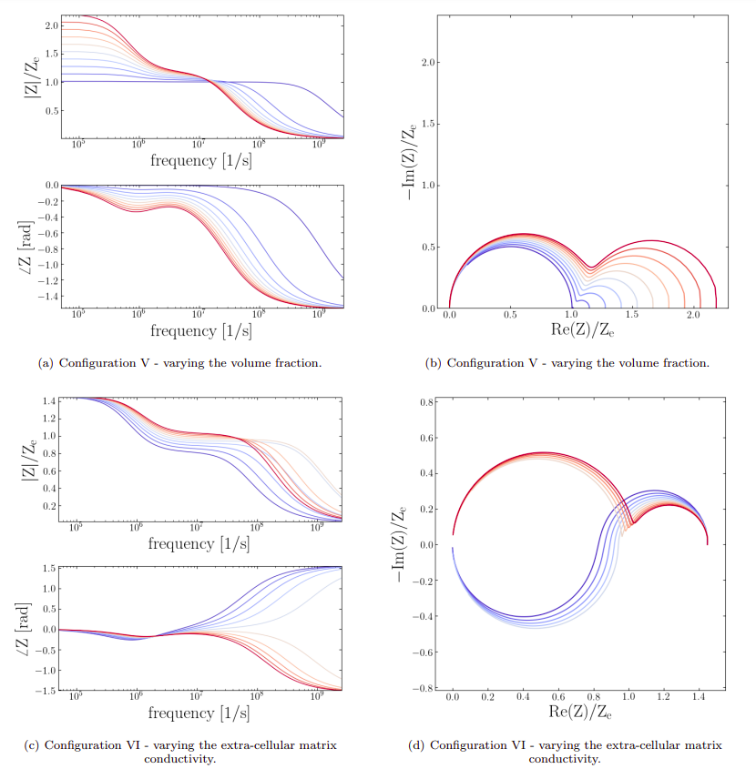

# Reduced order model for cell aggregate electroporation



This is a library that implements my reduced order model for electric response of a cell aggregate. This was a mathematical modeling project in my PhD and you can find more details in the reference below.

# Installation 

We recommend creating a virtual environment with Python 3.8+ on your local machine for testing this repository. Please follow the instruction below to create the virtual environment for MacOS or Linux. 

1. First install the python package for creating and managing virtual environments 
```
sudo pip install virtualenv virtualenvwrapper
``` 
2. Add the following to the shell startup script, either `.bashrc` (Linux) or `.bash_profile` (MacOS):
```
# virtualenv and virtualenvwrapper
export WORKON_HOME=$HOME/.virtualenvs
export VIRTUALENVWRAPPER_PYTHON=/usr/bin/python3
source /usr/local/bin/virtualenvwrapper.sh
```
To find the path to `virtualenvwrapper.sh` you can use: 
```
find / -name virtualenvwrapper.sh
```
 You should also use the corresponding `python3` installation accompanying the virtual environment.

3. Run `source ~/.bashrc` or `source ~/.bash_profile` 
4. Create a virtual environment (replace <VIRTUAL_ENVIRONMENT_NAME> with a proper name)
```
mkvirtualenv <VIRTUAL_ENVIRONMENT_NAME> -p python3.8
``` 
5. To activate the virtual environment, open a terminal and run
```
workon <VIRTUAL_ENVIRONMENT_NAME>
``` 


## Dependencies
To install dependencies, first activate the virtual environment you just created for this project and then run the following command from root directory of this repository:
```
workon <VIRTUAL_ENVIRONMENT_NAME>
pip install -r requirements.txt
```


# Usage Instructions: 

`$ python CAEP_PDF_evolve.py`: This is the main file with the actual solvers for the reduced order Fokker-Planck equations. 

There are 7 different test cases with different electric pulse profiles:

* `test_num = 0`: a constant indefinite pulse

* `test_num = 1`: a sinusoidal pulse with given frequency

* `test_num = 2`: an exponential decay pulse

* `test_num = 3`: a step pulse for 1 microseconds, then 1 microseconds of zero pulse.

* `test_num = 4`: The case considered in the paper and compared with direct numerical simulations.

* `test_num = 5`: The Gaussian pulse considered in the paper. For this test there are four different "cases" with different sets of matrix and cytoplasm conductivities, membrane conductance, volume fraction and duration of integration.

* `test_num = 6`: a smoothed step pulse, i.e. using a sigmoid function instead of a discontinuous step pulse.


`$ python FourierSpace.py`: This command will vary different parameters and makes the Cole-Cole and Bode plots reported in the paper.


# Reference

```bibtex
@misc{https://doi.org/10.48550/arxiv.2008.11819,
  doi = {10.48550/ARXIV.2008.11819},
  
  url = {https://arxiv.org/abs/2008.11819},
  
  author = {Mistani, Pouria A. and Pakravan, Samira and Gibou, Frederic G.},
  
  keywords = {Computational Engineering, Finance, and Science (cs.CE), Biological Physics (physics.bio-ph), Chemical Physics (physics.chem-ph), Computational Physics (physics.comp-ph), FOS: Computer and information sciences, FOS: Computer and information sciences, FOS: Physical sciences, FOS: Physical sciences},
  
  title = {A fractional stochastic theory for interfacial polarization of cell aggregates},
  
  publisher = {arXiv},
  
  year = {2020},
  
  copyright = {arXiv.org perpetual, non-exclusive license}
}

```